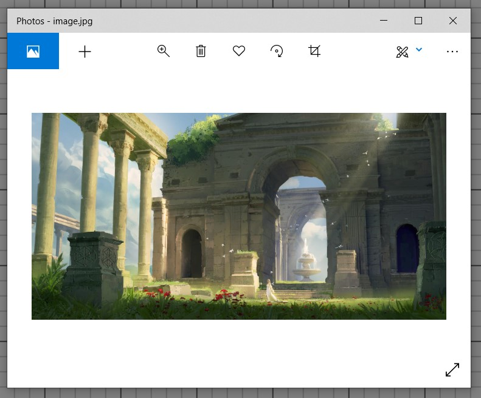
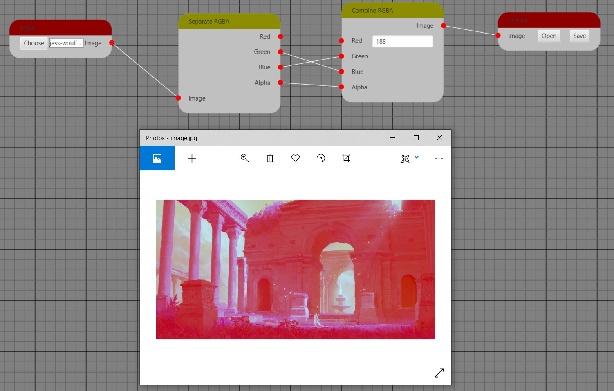

# HueU

View "report.docs" on Google slides [https://drive.google.com/file/d/1ligGvkOBpnv9iSvIURUc3aqGG-imfzdT/view?usp=sharing]. It is a very detailed documandtation.

You can change the color of a picture. Play with it.

## Easy performance
<table>
  <tr>
    <td>Put this image into input node</td>
  </tr>
  <tr>
    <td></td>
  </tr>
  <tr>
    <td>And you can play with its color. For example if you will set red color to fixed 188 value and replace green and blue with each other, output node will give according result image</td>
  </tr>
  <tr>
    <td></td>
  </tr>
</table>

## Advanced performance
<table> 
  <tr>
    <td>Make the work place such this</td>
  <tr>
    <td></td>
  </tr>
  <tr>
    <td>paris.jpg</td>
  </tr>
  <tr>
    <td></td>
  </tr>
  <tr>
    <td>Doslan.png</td>
  </tr>
  <tr>
    <td></td>
  </tr>
  <tr>
    <td>Result</td>
  </tr>
  <tr>
    <td></td>
  </tr>
  
